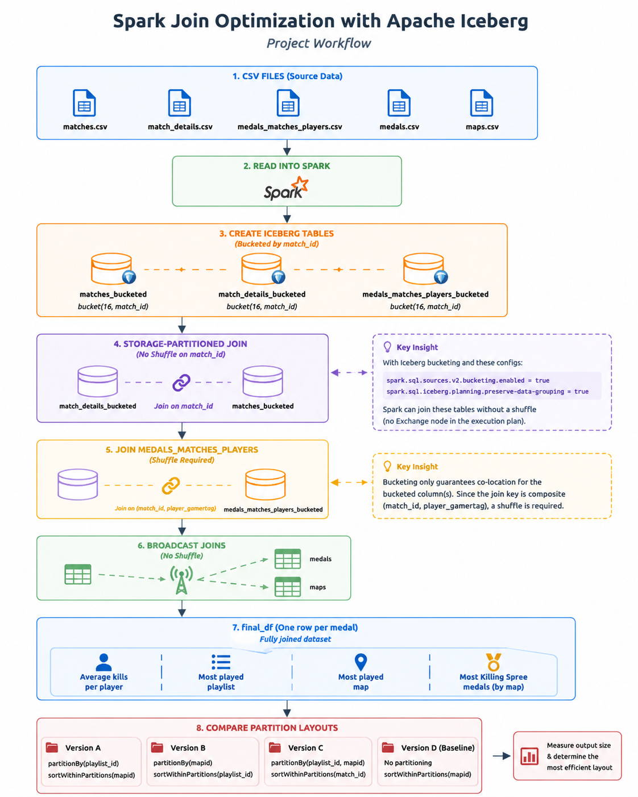

# Spark Join Optimization with Apache Iceberg

A PySpark project exploring how **Storage-Partitioned Joins**, **Broadcast Joins**, and different **partitioning strategies** affect query execution and storage efficiency when processing large-scale Halo 5 match data using Apache Spark and Apache Iceberg.

---

## Project Overview

Joins are among the most expensive operations in distributed data processing because they often require shuffling data across executors. This project investigates several Spark optimization techniques that reduce unnecessary shuffles and improve query performance while also examining how different partition layouts influence storage efficiency.

The project demonstrates:

- Storage-Partitioned Joins using Iceberg bucket transforms
- Explicit Broadcast Joins for small lookup tables
- Shuffle elimination using bucketed tables
- Different partitioning and sorting strategies
- Analytical queries over a fully joined dataset

---

## Technologies

- Apache Spark 3.3+
- PySpark
- Apache Iceberg
- Iceberg REST Catalog
- Spark SQL
- Docker

---

## Dataset

This project uses the Halo 5 match dataset provided in the **DataExpert.io Spark Fundamentals Bootcamp**.

Files used:

- `matches.csv`
- `match_details.csv`
- `medals_matches_players.csv`
- `medals.csv`
- `maps.csv`

The datasets are **not included** in this repository because they belong to the course material.

To reproduce the project, obtain the five CSV files from the course materials and place them in:

```text
/home/iceberg/data/
```

inside the Spark/Iceberg Docker container.

---

# Project Workflow

<p align="left">
  
</p>

---

# Project Objectives

This project answers the following analytical questions:

- Which player averages the most kills per game?
- Which playlist is played the most?
- Which map is played the most?
- Which map do players earn the most Killing Spree medals on?

Additionally, it compares four different physical storage layouts to determine which produces the smallest output size.

---

# Optimization Techniques

## 1. Disabling Automatic Broadcast Joins

Automatic broadcasting is disabled so that broadcast joins are controlled explicitly.

```python
spark.conf.set("spark.sql.autoBroadcastJoinThreshold", "-1")
```

---

## 2. Storage-Partitioned Joins

The three largest datasets are written as Iceberg tables bucketed by:

```text
bucket(16, match_id)
```

After enabling

```python
spark.conf.set("spark.sql.sources.v2.bucketing.enabled", "true")
spark.conf.set("spark.sql.iceberg.planning.preserve-data-grouping", "true")
```

Spark performs the join between `matches` and `match_details` **without a shuffle**.

This was verified using

```python
explain("formatted")
```

where no `Exchange` node appears before either side of the join.

> **Screenshot suggestion:** Add the physical execution plan here highlighting the absence of an `Exchange` operator.

---

## 3. Broadcast Joins

The lookup tables

- `medals`
- `maps`

are explicitly broadcast because they are significantly smaller than the fact tables.

This avoids unnecessary network shuffles while keeping the join efficient.

---

## 4. Why the Second Join Still Shuffles

Although all three large tables are bucketed using

```text
match_id
```

the join with `medals_matches_players` requires

```text
(match_id, player_gamertag)
```

Bucketing only guarantees co-location for the bucketed column(s). Since the join key is composite, Spark must still repartition the data before performing the join.

This behavior is expected and illustrates one limitation of bucket-based optimization.

---

# Working with `final_df`

The fully joined dataset (`final_df`) contains **one row per medal**, not one row per player per match.

As a result, player statistics are duplicated once for every medal earned.

To avoid fan-out bias:

- **Q1** removes duplicate player-match records before calculating average kills.
- **Q2** counts distinct matches rather than rows.
- **Q3** also counts distinct matches.
- **Q4** intentionally operates at medal granularity because medal counts are the desired metric.

This ensures each aggregation is performed at the correct level of detail.

---

# Partition Layout Comparison

To evaluate how physical data layout influences storage efficiency, `final_df` is written using four different strategies.

| Layout | Strategy |
|---------|----------|
| Version A | Partition by `playlist_id`, sort by `mapid` |
| Version B | Partition by `mapid`, sort by `playlist_id` |
| Version C | Partition by `playlist_id` and `mapid`, sort by `match_id` |
| Version D | No partitioning, sort only (baseline) |

Each output directory is measured to determine its total size on disk.

In general, partitioning by low-cardinality columns groups similar records into fewer files, which often improves compression and storage efficiency.

> **Screenshot suggestion:** Add a table or chart showing the output size of each layout.

---

# Key Findings

### Storage-Partitioned Join

✅ Joining `matches` and `match_details` on the bucketed column eliminates the shuffle.

### Broadcast Join

✅ Explicitly broadcasting small lookup tables avoids unnecessary repartitioning.

### Partitioning Strategy

✅ Different physical layouts produce different output sizes, demonstrating how partition design influences storage efficiency.

---

# Repository Structure

```text
.
├── spark_join_optimization_analysis.py
├── README.md
├── images
│   ├── execution_plan.png
│   ├── spark_ui.png
│   └── partition_comparison.png
```

---

# Running the Project

This project requires:

- Apache Spark
- Apache Iceberg REST Catalog
- Docker
- The five Halo CSV files

Run using:

```bash
docker exec -it spark-iceberg spark-submit spark_join_optimization_analysis.py
```

Alternatively, execute the script in a Jupyter notebook connected to the same Spark session.

---

# Future Improvements

Potential extensions include:

- Compare execution time before and after optimization
- Benchmark different bucket counts (8, 16, 32)
- Compare shuffle read/write metrics
- Add Spark UI screenshots
- Analyze file-size distribution across partitions
- Compare additional partitioning strategies

---

# What I Learned

This project gave me hands-on experience with:

- Storage-Partitioned Joins
- Apache Iceberg bucket transforms
- Broadcast Join optimization
- Spark execution plans
- Shuffle elimination
- Physical data layout design
- Partitioning strategies
- Query optimization in distributed systems